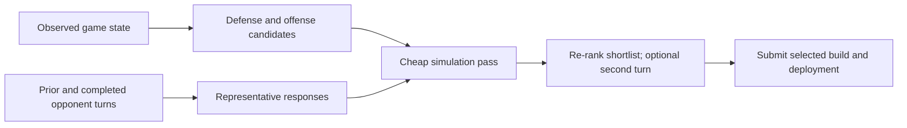

# Citadel Terminal: simulation-backed game search

A Python game-playing agent with a Rust action-phase simulator for
[Correlation One's Terminal](https://terminal.c1games.com/). Each turn the agent
constructs defense/offense plans, simulates representative opponent responses and selects a plan under a time budget. The central engineering work is making
those rollouts fast enough to be useful without losing the game's movement,
targeting, collision and float32 semantics.

For a quick technical tour, read the
[search loop](algos/smart_oracle_F2/oracle_core/search.py),
[Rust simulator](algos/athena/sim_rs/src/sim.rs) and
[engineering review](docs/ENGINEERING_REVIEW.md). The current code includes
post-competition correctness fixes; the
[archived competition revision](https://github.com/TahaKhanM/CitadelTerminal/tree/ce2142efe5c516f759410b3178bfe30907224377)
remains the reference for historical results.

## The decision problem

The Citadel ruleset uses a 28×28 diamond arena. Each player builds stationary
walls, turrets and supports with Structure Points, then deploys mobile units
with Mobile Points. Players choose their moves without seeing the other
player's current choices. The action phase resolves movement and combat;
resource decay makes waiting a decision with a cost.

The agent's main decision loop is:

1. **Construct candidate plans.** Defense templates combine with mobile-unit
   counts and legal launch positions, up to 2,500 plans in the final variant.
2. **Construct opponent scenarios.** A replay-derived action prior, later
   observations and explicit adversarial scenarios provide likely responses.
   The current implementation selects high-weight modes and chooses launcher
   tiles with a seeded RNG; it does not draw an unbiased Monte Carlo posterior.
3. **Cull and re-evaluate.** A cheap first pass uses one opponent scenario;
   the strongest candidates are reconsidered against up to six. A few plans
   can receive a second-turn rollout when time remains.
4. **Score and submit.** The evaluation values HP, surviving structures,
   resources and breaches, with penalties for wasted attacks and trapped
   offense. The final variant also penalizes dispersion across scenario scores.



This is **search over a designed candidate space**. Templates, utility weights,
scenario filtering and the second-turn policy encode heuristics. Search can
compare those alternatives; it cannot discover an action that was never
proposed. An 11-second search budget and a 13-second turn watchdog constrain
how much of the space is actually evaluated.

## Simulator design and tradeoffs

[`algos/athena/sim_rs/`](algos/athena/sim_rs/) implements the action phase in Rust
and exposes it through PyO3. State includes per-unit position, HP, shields,
movement progress and stable identifiers; pathfinder and spatial lookup code
support repeated combat rollouts. The
[engine-ordering notes](research/engine_decompiled/GOTCHAS.md) explain details
recovered while comparing behavior with the Java engine.

The Python reference and Rust port use float32 arithmetic because the Java
engine's accumulation and targeting thresholds can depend on rounding. The
instrumented path emits detailed observations for validation; the fast path
avoids constructing every frame's replay representation. Both need to finish
at the same state.

The repository retains measurements of roughly **14,300 single-core action-phase
simulations/s** and **75,000/s with ten threads** on one midgame fixture.
These are historical fixture measurements, not complete games per second or
portable performance guarantees. The notes also record unsuccessful optimization
attempts and unmet throughput targets. See
[`SIM_PARITY.md`](algos/athena/sim/SIM_PARITY.md) for that history.

A native extension improves search coverage but adds a platform/ABI build step.
The agent includes a NumPy-based Python simulator for portability. Both paths
must produce real state transitions: a missing or broken simulator must not be
silently replaced by an unchanged input state.

## Adaptation and evaluation

A rolling opponent classifier measures launch concentration and unit diversity.
A separate funnel detector tracks concentrated breaches and adds targeted
structure templates. That classification also filters the opponent scenarios
considered by search. It can therefore bias the decision in the wrong direction;
there is no guarantee that enabling adaptation cannot lose a previously won
match.

The retained prior was built from 427 ranked replays. Replays used to diagnose
losses or tune responses are development data. Evaluating on those opponents
again is a regression check, not an independent estimate of tournament strength.
For an interview, the important distinction is between simulator fidelity,
performance against a fixed test pool and generalization to unseen opponents.

## Results with their evidence boundaries

| Evidence | What can be concluded |
|---|---|
| [Reconstructed team leaderboard](data/CITADEL_LEADERBOARD.md), 26 April 2026 | Wick (TAHA and Rham) ranks fifth by the report's peak-rating rule among the observed teams, before the submission deadline. This is not an official final table. |
| [F2 development report](algos/smart_oracle_F2/VARIANT_SMART_ORACLE_F2_REPORT.md) | Documents four loss diagnoses and a small local development benchmark. Its summary reports 9/9 and includes equal-HP self-play; it does not substantiate the previous README's blanket 12–0 F2 claim. |
| [Historical simulator reports](algos/athena/sim/PARITY_REPORTS/) | Record a 19-column exact gate over 87,677 Java replay frames with a documented cascade tolerance in four other columns. The ranked corpus is absent from the public default checkout. |
| Current local verification, 8 September 2026 | 42 Rust tests, 10 evaluation tests, 5 regression tests per search variant and 240 seeded synthetic dual-mode cases passed. |
| Current F2 vs bundled starter, both sides | 2 wins, 0 errors; surviving F2 HP was 35 on each side. A functional smoke comparison against a weak baseline, not a new strength claim. |

The earlier README and application PDF state a top-five finish among 1,000+
entrants. The retained data above support a narrower, dated reconstructed
standing; an official final result is not independently established in this
checkout. The PDF is an authored portfolio summary, not external verification.
Similarly, Python↔Rust fuzz parity is distinct from comparison with the Java
engine. Historical figures have not all been rerun during the current review.

## Run it

Use Python 3.11+ and NumPy for the portable simulator. Full matches also need
Java 10+; native compilation additionally needs Rust and maturin. macOS and
Linux/WSL are the maintained local platforms.

```bash
python3 -m venv .venv
source .venv/bin/activate
python -m pip install -r requirements.txt

# One initial-turn protocol check; rejects turn fallback and malformed output.
./tools/test.sh algos/smart_oracle_F2

# One full game, isolated config and replay output.
./tools/run.sh algos/smart_oracle_F2 C1GamesStarterKit-master/python-algo

# One game per side. Increase N for a larger, explicitly chosen evaluation.
python tools/bestof.py algos/smart_oracle_F2 C1GamesStarterKit-master/python-algo 1 --serial
```

Set `PYTHON_CMD=/path/to/python` when the engine should launch a particular
interpreter. Every match now gets its own configuration copy and replay folder;
`summary.json` preserves outcomes and failure diagnostics. Incomplete engine
runs are errors, excluded from measured win-rate denominators and make the
command exit nonzero. The printed Wilson interval is nominal: repeatedly
running deterministic opponents/seeds does not produce independent evidence.

For native simulation, from the activated environment:

```bash
python -m pip install 'maturin>=1.4,<2'
cd algos/athena/sim_rs
maturin develop --release
cargo test --locked --lib --tests
```

[Local testing details](docs/workflow/LOCAL_TESTING.md) cover the maintained
verification commands. CI exercises the public, self-contained checks; missing
ranked replay tests are reported as skipped, not as successful zero-case parity.

## Where to read next

| Path | Purpose |
|---|---|
| [`algos/smart_oracle_F2/`](algos/smart_oracle_F2/) | Final competition family, now with dated correctness fixes |
| [`algos/oracle_pure/`](algos/oracle_pure/) | Earlier search baseline and component tests |
| [`algos/athena/sim_rs/`](algos/athena/sim_rs/) | Rust state, pathfinding, combat systems and PyO3 bindings |
| [`algos/athena/sim/`](algos/athena/sim/) | Python reference, synthetic fuzzer and historical parity tooling |
| [`tools/match_runner.py`](tools/match_runner.py) | Shared isolated engine runner and validated outcome parsing |
| [`docs/devlog/`](docs/devlog/) | Competition-era experiments, including rejected variants |
| [`research/`](research/) | Opponent analyses and engine-behavior notes |

## Attribution and remaining work

Muhammad Taha's commits cover the agent, simulator integration, search and replay
workflow. The competition team recorded in the retained roster is **Wick: TAHA
and Rham**. The repository also contains agent-assisted development notes; code
volume is not a useful measure of independent contribution.

The game engine, starter library and community examples come from
[Correlation One's starter kit](https://github.com/correlation-one/C1GamesStarterKit).
Their [license](C1GamesStarterKit-master/License.md) remains applicable, including
the noncommercial restriction. Earlier heuristic bots and third-party baselines
are evaluation/reference material, not original work claimed by this portfolio.

The next substantial improvement would be a versioned held-out opponent pool,
seed and side pairing, full match diagnostics and a Java replay fixture corpus
that can be distributed with the repository. Search still approximates future
resource/structure transitions and depends heavily on candidate coverage. The
[engineering review](docs/ENGINEERING_REVIEW.md) records those limits alongside
the specific correctness changes, without attributing later fixes to the
competition submission.
